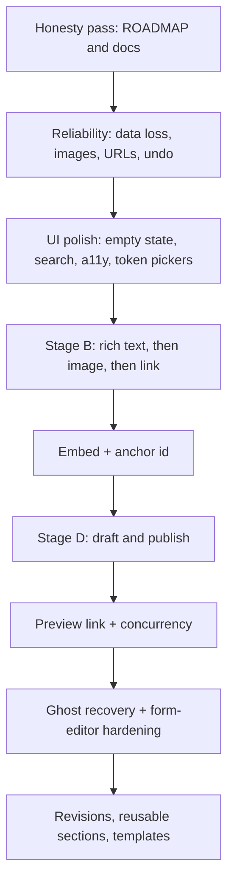

# Page builder improvement pack

Planning artifacts for the next stretch of work on the canvas. They were
written against the code on `dev` after four parallel reviews of the
editor chrome, the feature set, the reliability surface, and the
departmental-editor journeys.

This pack does **not** change product behaviour. It is the brief for the
work that should.

| Artifact | What it answers |
|---|---|
| [00 — Honest status](00-honest-status.md) | What is actually shipped versus what `ROADMAP.md` still marks done |
| [01 — Reliability](01-reliability.md) | Bugs, data-loss, and security that should land before new features |
| [02 — UI and UX](02-ui-ux.md) | Chrome, canvas, inspector, outline, keyboard, and accessibility |
| [03 — Editor journeys](03-editor-journeys.md) | Ten real editing paths and where they break |
| [04 — Feature backlog](04-feature-backlog.md) | Now / next / later, with effort and sequencing |

The architectural bet stays the one already decided in `ROADMAP.md`:
**typed blocks are the unit of layout; elements inside a block become
directly editable.** The package owns the mechanism. The application owns
the content. There is one Blade view per block, used on the canvas and
the public site. Style knobs are tokens, not raw CSS. Consumers never
run a bundler.

---

## Recommended sequence

Do the reliability work first. Several Stage B features would otherwise
land on a canvas that can silently drop a clone, save without the
in-progress edit, or write a `javascript:` button.

---

## What is already good

The canvas is a nested layout editor, not a form pretending to be one.

- Palette, document outline, content/style inspector, explicit save
- Flat tree (`parent` / `slot` / `position`) with undo in the session
- Plain-text inline editing, keyboard shortcuts, unsaved-work guards
- Token style inspector and a desktop / tablet / mobile width toggle
- Retired types kept on save; six shipped primitives
- 113 Livewire / Pest tests around the mutations that matter

The gaps are **honesty** (the roadmap over-claims), **safety** (the form
editor and two-tab saves can destroy content), **inline richness** (text
only), and **workflow** (save writes the live column).

---

## What this pack refuses

These would violate the premise and are out of scope:

- A free-form / GrapesJS-class canvas as the core editor
- A second renderer (Vue, React, or iframe) that drifts from Blade
- Raw CSS in the inspector
- A `Page` model, site migrations, or a media library in the package
- Form-submission blocks
- A default `FreeCanvasBlock` hatch (Stage E) until a real poster-page
  need appears

---

## How to use these artifacts

1. Treat [01 — Reliability](01-reliability.md) as the next implementation
   queue. Twelve items, in order.
2. Use [02 — UI and UX](02-ui-ux.md) and
   [03 — Editor journeys](03-editor-journeys.md) when touching chrome,
   copy, or keyboard behaviour — they name the surfaces and the copy.
3. Pull features from [04 — Feature backlog](04-feature-backlog.md)
   only after the matching reliability item is done (the backlog
   records those dependencies).
4. When a claim in `ROADMAP.md` or `docs/index.html` is fixed, update
   that file in the same commit. The honesty table in
   [00 — Honest status](00-honest-status.md) is the checklist.
